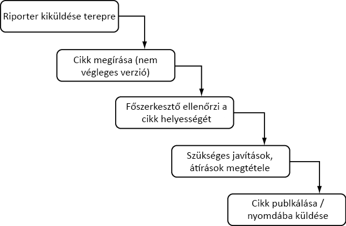
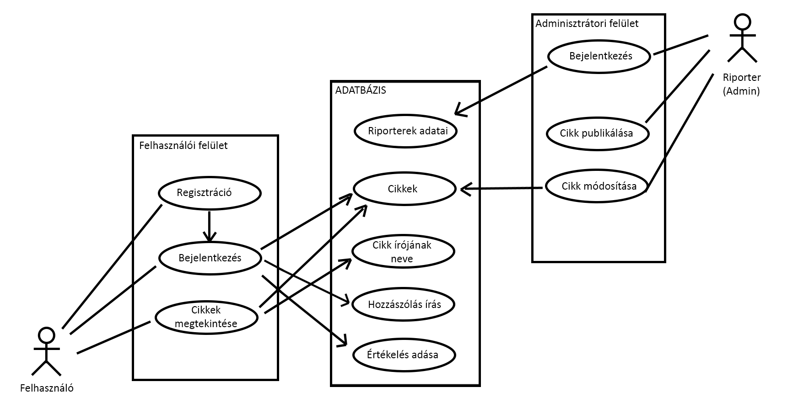

# Hírportál követelmény specifikáció

> ## Jelenlegi helyzet leírása
>
> Blink-Hírek elsőkézből "hitelesen" ;) 
> A Blink.hu oldalunk ellátja az olvasóinkat a legfrissebb hírekkel az ország leghihetőbb hírportálján.
> A szlogenünk Blink újságnál az, hogy "Egy szempillantás alatt megújul a világ". 
> A híreink között megtalálhatóak olyan témák is mint a politika, gazdaság, sport, erotika, külpolitika és világjárvánnyal kapcsolatos hírek.
> Mi mindig ott vagyunk ahol van a hír, Blink.

> ## Vágyálomrendszer
>
> Újságunk terjesztése érdekében szeretnénk egy online honlapot, valamint a híreink frissítéséhez könnyen módosítható kódot.
> Célunk, hogy az ügyfeleink naprakész információkat kaphassanak az elérhető hírekről online is.
> Olyan honlapot szeretnénk ami HTML alapú, CSS file-beli megformázással és JavaScript integrálással, ezáltal legyenek könnyen modósíthatóak híreink.
> Az online megjelenítés mobil eszközön, különböző felbontású képernyőkön is jól látható legyen, reszponzív felület kialakítással.

## Jelenlegi üzleti folyamatok

## Igényelt üzleti folyamatok

> ## Rendszerre vonatkozó szabályok 
> 
> A web felület szabványos eszközökkel készüljön, html/css/javascript.  
> A képek jpeg és png formátumúak lehetnek.  
> A felhasználókat azonosító web oldalak esetében szükséges jogszabályokat be kell tartani: GDPR

> ## Követelménylista
> 
> K01. Könnyen üzemeltethető oldal  
> K02. Reszponzív dizájn megoldás  
> K03. Szerepkörök kezelése (cikkszerkesztő, látogató)

> ## Fogalomszótár
> 
> GDPR: A GDPR a General Data Protection Regulation kezdőbetűiből képzett mozaikszó, magyarul általános adatvédelmi rendelet. 
> Hír: Olyan információs egység, mely rendelkezik egy címmel, egy rövid leírással, egy létrehozási dátummal és egy a témához kapcsolódó képpel. 
> Reszponzív dizájn: gy olyan megközelítéssel tervezett weboldal, amelynek a célja az, hogy optimális megjelenést biztosítson - könnyű olvashatóság, egyszerű navigáció a lehető legkevesebb átméretezéssel és görgetéssel - a legkülönfélébb eszközökön (az asztali számítógép monitorjától egészen a mobiltelefonokig)
