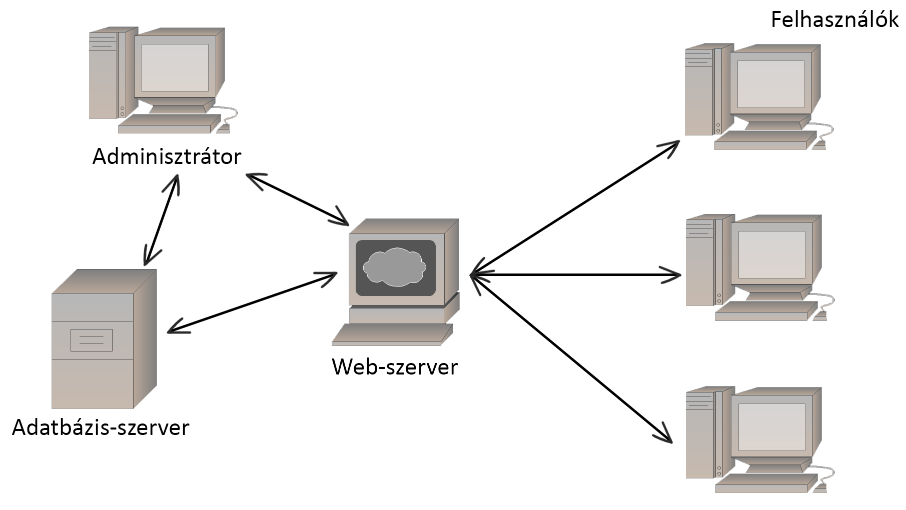

# Rendszerterv
## 1. Bevezető  
**- A Blink News újság és hírportál cikkjeinek nyilvántartása**  
A cikk újságban, folyóiratban megjelent vagy abba szánt rövidebb írásmű, közlemény.
Általában az egésztől könnyen elválasztható egészként definiáljuk.
Az alábbi paraméterei lehetnek:
- Általános adatok: cím, cikkíró, tartalom, kategória
- Felelősök: Azon munkatársak, akik adminisztrátori jogosultságú fiókkal rendelkeznek, engedélyezett számukra  
a cikkek publikálása, módosítása, törlése.
- Előterjesztők: A főszerkesztő a cikkek publikálása előtt ellenőrzi a cikk helyességét, valóságát, esetleges javításokat végezhet rajta.
- Állapotok: A cikkek megírásának és publikálásának számos lépései vannak, ezek a következők:
   - Riporter kiküldése a helyszínre (cikk anyaggyűjtés)
   - Cikk megírásának menete (nem végleges verzió)
   - Főszerkesztő elvégzi a cikk ellenőrzését
   - Ellenőrzés után a szükséges átírások megtétele (főszerkesztő által)
   - Cikk publikálása (nyomdai úton, valamint online portálra)

**Felhasználói adatok tárolása**  
Az online hírportált bárki szabadon látogathatja, a cikkeket megtekintheti, azonban egyes az oldal egyes funkcióit csak a regisztrált  
felhasználóink érhetik el. A regisztrált felhasználók email és jelszó párossal tudnak bejelentkezni.
Az alábbi jogosultsági szinteket különböztetjük meg:
   - Adminisztrátor
   - Felhasználó
   - Vendég
A felhasználókról nyilvántartott adatok:
- Általános adatok: email cím*, felhasználónév*, jelszó*, telefonszám (a csillaggal jelöltek megadása kötelező)
Munkatársainkról nyilvántartott adatok:
- Általános adatok: email cím*, név*, jelszó*, telefonszám*

## 2. A Blink News hírportál fizikai kiépítése  
Hírportálunknak az Internet topológiára épülő szokásos kliens-szerver felépítésű struktúrával kell rendelkeznie.
  
Megjegyzés: Az ábra nem a tényleges projekt megvalósítást reprezentálja, csupán demonstráló értékű.  

## 3. Adattárolás  
A hírportálunk által tárolt személyes információkat JSON fájlban akarjuk tárolni. Ebbe beleértve a felhasználói adatokat, valamint az adminisztrátoraink által  ű
feltöltött cikkeket is (az ő adataik mellett). Az oldalnak képesnek kell lennie eltárolni a megadott adatokat regisztrálás után, valamint beolvasni és értelmezni ezen adatokat bejelentkezéskor,  
valamint a cikkek megjelenítésekor.

## 4. Oldal megjelenítése  
Az oldal megjelenítésére HTML nyelvet kell használni, CSS fájlformátumbeli megformázással. Az oldalnak reszponzív dizájnnal kell rendelkeznie, minden eszközön megfelelő méretezéssel kell megjelenjen.
Az alábbi ábra a főoldal, valamint egy cikk aloldal megjelenését mutatja sablonosan.  
(ÁBRA 2)  
A színeknek harmónikusaknak kell lenniük, hogy ne zavarja a felhasználók látását, ugyanakkor szaturált színek használata előnyös a figyelemfelkeltés végett.

## 5. A rendszer használatának szabályai
A jelszavas bejelentkezést követően a különböző felhasználói csoportoknak más-más lehetőségeik lesznek a rendszerben.
- Adminisztrátor:
	- Minden általa publikált cikket teljes jogkörrel módosíthat
	- Saját cikkjeit törölheti
	- Karbantarthatja a felhasználók hozzászólásait
	- Feltölthet új cikket az oldalra
	- Hozzáfér a rendszerfelületi modulhoz
- Felhasználó:
	- Megtekintheti a cikkeket
	- Értékelést adhat egy cikkre
	- Hozzászólásos véleményt írhat egy cikk alá
- Vendég:
	- Megtekintheti a cikkeket
